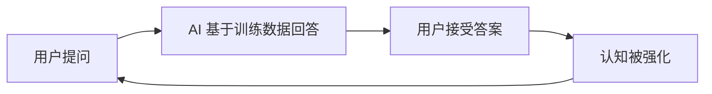

## 2026-03-01 AI 时代下的理性思考：警惕"AI 谗言"，保持独立判断

### 引言

2026 年，人工智能的发展已经渗透到我们生活的方方面面。从日常的内容创作到复杂的商业决策，AI 似乎无处不在。然而，在这个 AI 高速发展的时代，我们不得不面对一个严峻的现实：**部分使用者正被 AI 的"谗言"蒙蔽，导致错误决策的产生**。

这里的"AI 谗言"并非指 AI 有意欺骗，而是指：
- 对 AI 输出内容的**盲目信任**
- 缺乏对 AI 生成信息的**批判性验证**
- 过度依赖 AI 而丧失**独立思考能力**

> ⚠️ **核心问题**：AI 是强大的工具，但它不应该替代人类的判断力。

---

### 一、AI 在不同行业的应用现状

#### 1.1 软件开发领域

```javascript
// AI 生成的代码示例 - 看起来完美，但可能隐藏问题
async function fetchData(url) {
    const response = await fetch(url);
    return await response.json();
}
```

**优势**：
- 快速生成样板代码
- 提供多种实现方案
- 辅助调试和错误定位

**风险**：
- 可能生成存在安全漏洞的代码
- 缺乏对业务逻辑的深度理解
- 过度依赖导致开发者技能退化

#### 1.2 内容创作领域

| 应用场景 | AI 能力 | 潜在问题 |
|---------|--------|---------|
| 文章写作 | 快速生成初稿 | 事实准确性存疑 |
| 代码文档 | 自动生成注释 | 可能过时或错误 |
| 翻译服务 | 多语言互译 | 语境理解不足 |

#### 1.3 数据分析领域

AI 在数据处理方面表现出色，但需要警惕：
- **数据偏见**：训练数据本身的偏见会被放大
- **相关性≠因果性**：AI 发现的关联不一定是因果关系
- **黑箱决策**：复杂模型的可解释性不足

---

### 二、AI 的正面影响

#### 2.1 效率提升

- 📈 **生产力革命**：重复性工作自动化，释放人类创造力
- ⚡ **快速迭代**：原型开发时间从数天缩短到数小时
- 🌍 **知识民主化**：降低专业领域门槛

#### 2.2 创新赋能

```
传统模式：学习 → 实践 → 创新（周期长）
AI 辅助：想法 → AI 辅助实现 → 验证（周期短）
```

#### 2.3 个性化服务

- 教育：自适应学习路径
- 医疗：个性化诊疗方案
- 娱乐：精准内容推荐

---

### 三、AI 的反面影响与风险

#### 3.1 认知依赖症

**症状表现**：
1. 遇到问题第一反应是"问 AI"而非独立思考
2. 对 AI 输出不加验证直接采用
3. 逐渐丧失基础技能（如心算、拼写、基础编程）

**真实案例**：
> 某开发者直接使用 AI 生成的数据库查询代码，未进行安全审查，导致 SQL 注入漏洞。

#### 3.2 信息茧房强化



#### 3.3 决策风险

**商业决策中的 AI 谗言**：
- 市场分析报告可能基于过时数据
- 竞争分析缺乏实地调研的洞察
- 财务预测忽略黑天鹅事件

#### 3.4 伦理与社会问题

- 🤖 **就业冲击**：部分岗位被替代
- 🔒 **隐私泄露**：数据收集边界模糊
- ⚖️ **责任归属**：AI 决策错误的责任认定

---

### 四、如何保持理性：对抗"AI 谗言"的策略

#### 4.1 建立验证机制

```
AI 输出 → 事实核查 → 逻辑验证 → 专家咨询 → 最终决策
```

**实践建议**：
- ✅ 对关键信息进行**多源交叉验证**
- ✅ 要求 AI 提供**推理过程和依据**
- ✅ 保持**领域专业知识**的持续学习

#### 4.2 培养批判性思维

| 问题类型 | AI 擅长 | 人类擅长 |
|---------|--------|---------|
| 事实检索 | ✅ | ⚠️ |
| 模式识别 | ✅ | ⚠️ |
| 价值判断 | ❌ | ✅ |
| 伦理决策 | ❌ | ✅ |
| 创新突破 | ⚠️ | ✅ |

#### 4.3 合理使用 AI 的原则

1. **辅助而非替代**：AI 是副驾驶，你才是机长
2. **理解而非盲从**：理解 AI 为什么给出这个答案
3. **验证而非假设**：假设 AI 可能出错，主动验证
4. **学习而非依赖**：用 AI 学习，而非让 AI 代劳

---

### 五、面向未来的建议

#### 对个人

- 📚 **持续学习**：保持对新技术的理解和批判能力
- 🧠 **深度思考**：定期进行无 AI 辅助的思考训练
- 🔍 **信息素养**：提升信息甄别和验证能力

#### 对组织

- 📋 **制定 AI 使用规范**：明确哪些场景可以使用 AI
- 👥 **人机协作培训**：培养团队正确使用 AI 的能力
- 🛡️ **建立审核机制**：关键决策保留人工审核环节

#### 对社会

- 🏛️ **完善监管框架**：建立 AI 伦理和法律责任体系
- 🎓 **教育改革**：培养适应 AI 时代的核心素养
- 🤝 **公众教育**：提升全民 AI 素养和风险防范意识

---

### 结语

AI 时代的到来不可逆转，它既是机遇也是挑战。关键在于我们如何**保持理性、独立思考**，不被"AI 谗言"蒙蔽双眼。

> 💡 **记住**：最强大的人机协作模式是 **人类智慧 + AI 能力**，而非**人类依赖 + AI 主导**。

在这个 AI 无处不在的时代，让我们做**驾驭 AI 的主人**，而非**被 AI 支配的傀儡**。

---

**参考文献**：
1. Stanford AI Index Report 2025
2. MIT Technology Review - The AI Dependence Problem
3. Harvard Business Review - Making Better Decisions with AI

---

### 📌 关于本文

> **AI 辅助创作声明**：本文由作者构思核心观点和结构，使用 AI 辅助完成内容撰写和资料整理。文中所有观点均为作者独立思考的结果，AI 仅作为写作工具使用。
> 
> 这正是本文主题的实践体现——**人类主导 + AI 辅助**的正确协作模式。

**标签**：#AI #人工智能 #批判性思维 #技术伦理 #决策科学
